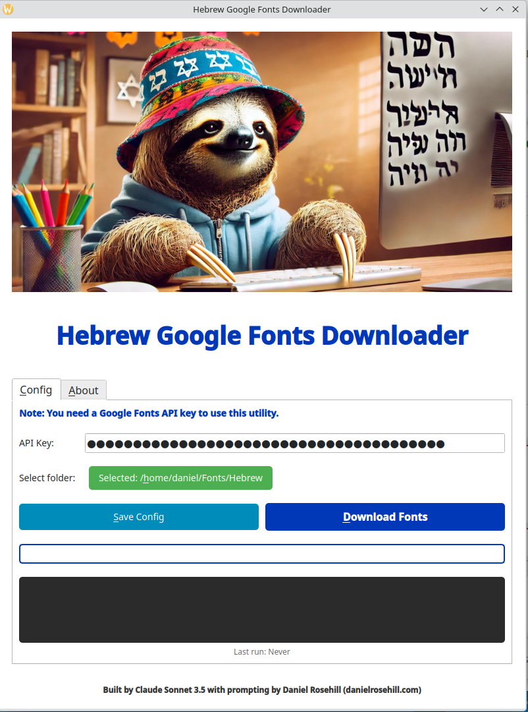
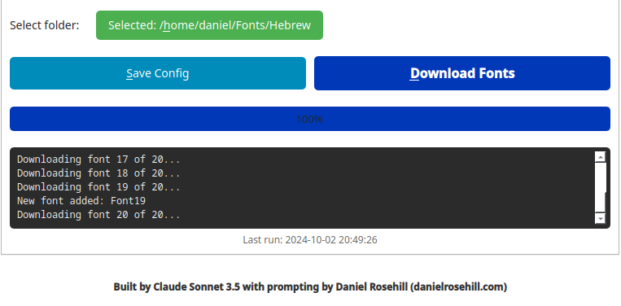
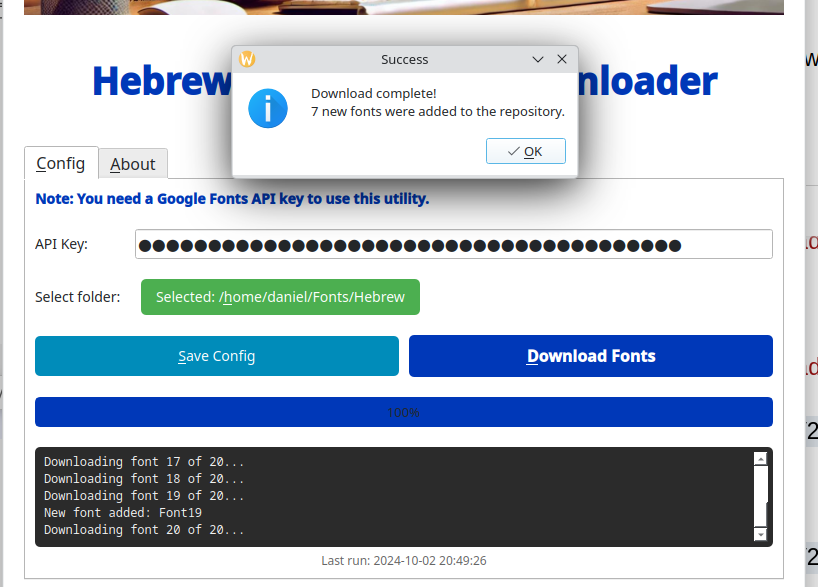
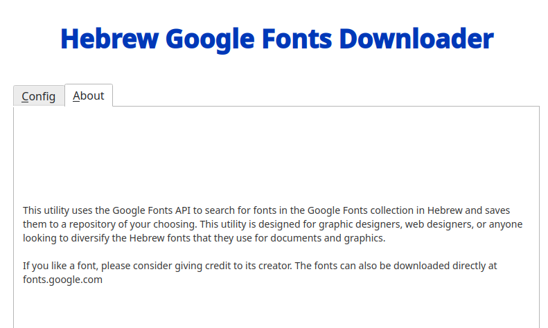
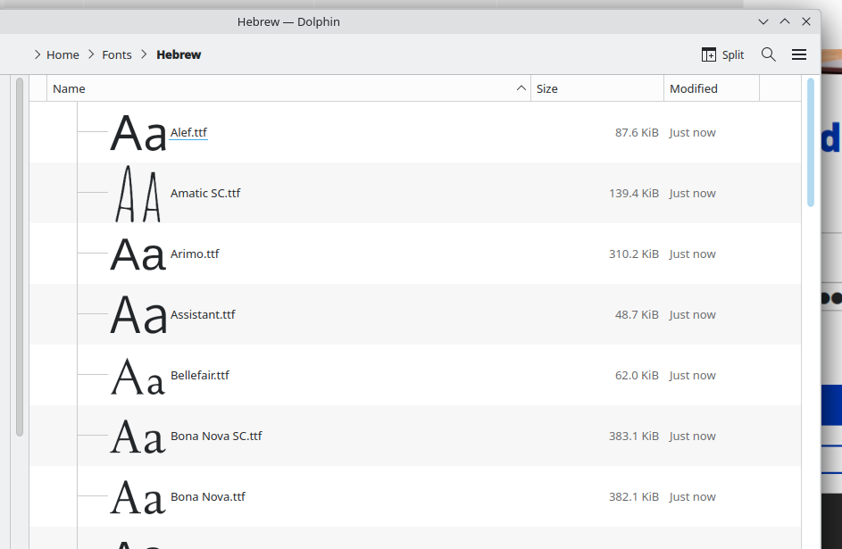

# Downloading Utility For Google Fonts In Hebrew

 

## Purpose Statement

This program is a simple utility for downloading a collection of Google Fonts that are available to use in Hebrew.

The utility is designed so that it can be run periodically to download new fonts to your computer as they are released by font creators.

You need a Google Fonts API key in order for this to work.

## Screenshots (V3)

## Author

Claude Sonnet 3.5 with prompting by:

Daniel Rosehill  
(public at danielrosehill dot com)

## Icons

Sloth icon by Juicy Fish

## Licensing

This repository is licensed under CC-BY-4.0 (Attribution 4.0 International) 
[License](https://creativecommons.org/licenses/by/4.0/)

### Summary of the License
The Creative Commons Attribution 4.0 International (CC BY 4.0) license allows others to:
- **Share**: Copy and redistribute the material in any medium or format.
- **Adapt**: Remix, transform, and build upon the material for any purpose, even commercially.

The licensor cannot revoke these freedoms as long as you follow the license terms.

#### License Terms
- **Attribution**: You must give appropriate credit, provide a link to the license, and indicate if changes were made. You may do so in any reasonable manner, but not in any way that suggests the licensor endorses you or your use.
- **No additional restrictions**: You may not apply legal terms or technological measures that legally restrict others from doing anything the license permits.

For the full legal code, please visit the [Creative Commons website](https://creativecommons.org/licenses/by/4.0/legalcode).